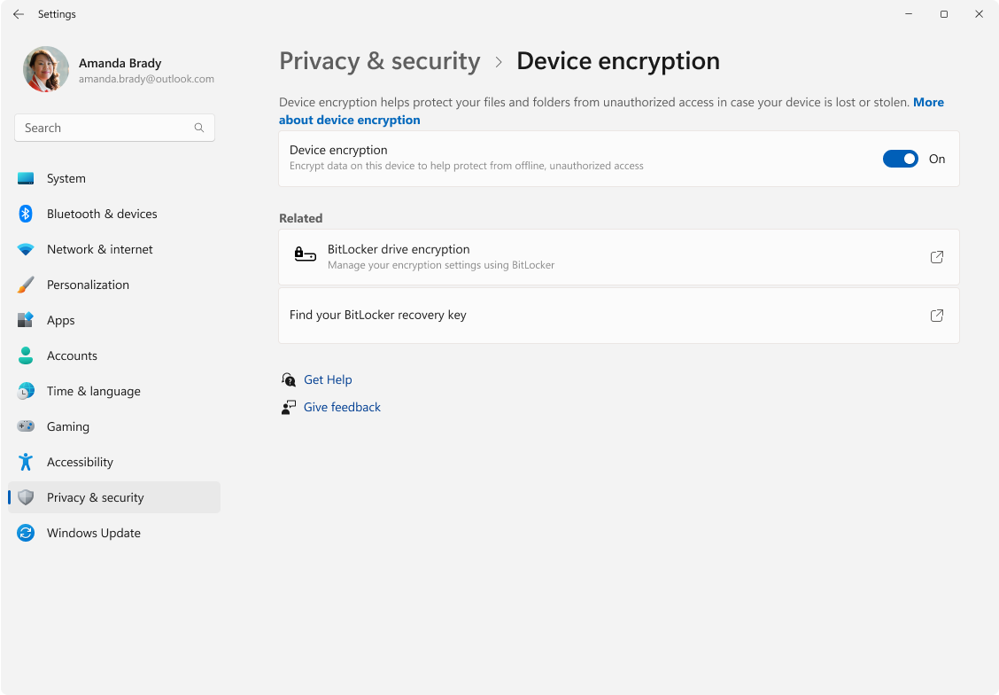
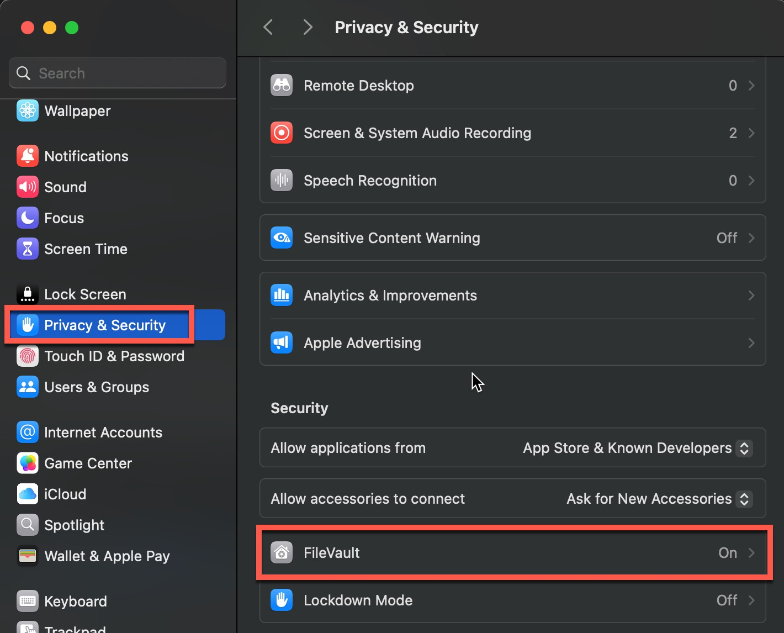

# Laptop Encryption Guide

This guide is for those who will be accessing or storing sensitive data on their laptops (e.g. client data in STAT 450/550) and must have their laptop's hard drive encrypted to prevent data theft. This guide will also work for desktop computers.

The method for encrypting your device will be different depending on its operating system. For Windows and MacOS encrypting your device's hard drive will not affect the files already stored on the machine and you can even use the device while it's encrypting the hard drive. In technical terms, it will encrypt the hard drive in place. However if you're using a Linux device, one can only encrypt the hard drive during a fresh Linux OS install (Linux encryption isn't covered in this guide but there are several online guides depending on Linux distribution).

For any encryption method, **always** keep a note/record of the recovery key in a safe location (For Windows it will be stored with your Microsoft account, MacOS has the option to store it with your iCloud account). If the hard drive is ever locked out due to theft, your device will be unusable until the hard drive is unlocked with the recovery key.

## Instructions by Operating System

### Windows

1. Sign in to Windows with an account linked to Microsoft (i.e. not a local user account)

2. In the Settings app, select Privacy security > Device encryption

3. Use the toggle button to turn Device Encryption On

4. Your hard drive is now being encrypted and you can use your device normally.

### MacOS

1. On your Mac, open System Settings (in Launchpad or Applications folder), click Privacy & Security  in the sidebar, then click FileVault. (You may need to scroll down.)

2. Click Turn On.

    You might be asked to enter your password.

3. Choose how to unlock your disk and reset your login password if you forget it:

    iCloud account: Click “Allow my iCloud account to unlock my disk” if you already use iCloud. Click “Set up my iCloud account to reset my password” if you don’t already use iCloud.

    Recovery key: Click “Create a recovery key and do not use my iCloud account.” Write down the recovery key and keep it in a safe place.

4. Click Continue.

5. The hard drive will be encrypted in the background, you can continue using your device normally.
