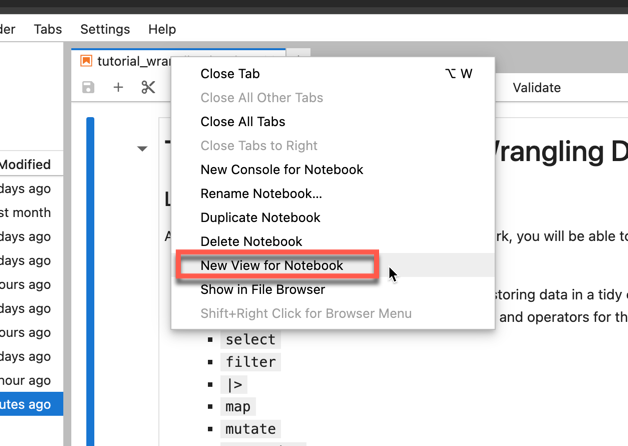
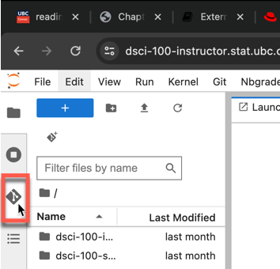

# JupyterHub Guide

This guide contains tips and FAQs which help to avoid common issues that arise when using JupyterLab.  

# Table of Contents
### Tips
1. [Open multiple notebook tabs](#open-multiple-notebook-tabs)
2. [Check memory usage](#check-memory-usage)
3. [Clone a GitHub repo](#clone-a-github-repo)
4. [Get a copy of everything](#get-a-copy-of-everything)

### FAQs
1. [Why are none of my cells running?](#why-are-none-of-my-cells-running)
2. [Why does my kernel keep dying?](#why-does-my-kernel-keep-dying)
3. [I am getting a 400 (Bad Request) or 404 (Not Found) error, how do I fix it?](#i-am-getting-a-400-bad-request-or-404-not-found-error-how-do-i-fix-it)

## Tips

## Open multiple notebook tabs

When working on a notebook, you might want to have multiple tabs of the same notebook open to easily reference previous questions.

**DO NOT** open another browser tab, create another instance of JupyterLab, and open the same notebook. Doing so may overwrite the notebook you are working on with an empty or half-completed version.

Instead, use JupyterLab's built in tab functionality to create another view for the notebook.

To do so in JupyterLab, right click the tab that contains the notebook in question.

On the dropdown menu, click **New View for Notebook**:    



This will create a split screen, showing a copy of the notebook on half of the screen.

## Check memory usage

Student JupyterLab instances are limited to 2GB (2048MB) of memory usage, if that limit is reached by running a notebook then the kernel will be killed and cells will stop running.

To check how much memory JupyterLab is using, there is a indicator on the bottom left of the window:


The maximum amount of memory usage a notebook should use is around 1GB (1024MB). If you find that JupyterLab is hitting the limit very often, here are some steps you can take:

### Restart your JupyterLab server

On the top left, go to **File -> Hub Control Panel** and it will open a window with a red button with text **Stop My Server**, click the button and then click the **Log Out** button on the top right. 

Close the browser tab and then open JupyterLab again from Canvas.

### Check your code

If restarting your server does not work, then there may be an issue with your code.

Run your notebook one cell at a time. If you hit a cell that causes memory usage to hit the 2GB limit, examine the code in the cell to make sure there aren't any errors e.g. running a function on unfiltered data.

## Clone a GitHub repo

To clone a GitHub repo for collaborative work, follow these steps:

1. Find the HTTPS repo link from GitHub and copy it to the clipboard


2. Go to your JupyterLab and make sure you're in the home directory by clicking the small grey folder icon on the top left of the menu that shows your files and folders


3. Go to the JupyterLab git extension menu by clicking its tab on the left of JupyterLab:



4. Click "Clone a Repository" and then paste the repo link from step 1 into the box and click Clone.


The repo should now be in your home directory in a folder titled with the name of your repo.

To get to your cloned repo, remember to navigate to the home directory as shown in step 2.

## Get a copy of everything

To get a zipped copy of all of your work at the end of term:

1. Open a terminal by clicking the terminal icon when you first open JupyterLab from the Canvas homepage or in a new JupyterLab tab.
  


2. Enter the following command into the terminal:
```
cd /home/jovyan/work/ && zip -r backupjupyterlab.zip *
```
If you received a `Disk quota exceeded` error, then there are too many files. Delete any files or folders that you don't need (especially large .csv files) and try the command again.

3. Go to your home folder [as described here](#check-solutions-or-feedback) and there should be a zip file. Right-click the file and click Download to download a copy onto your device. 

## FAQs

### Why are none of my cells running?

Before anything else, try restarting JupyterHub as described [here](#restart-your-jupyterlab-server).

Make sure you're using a compatible browser. We recommend Chrome, Edge, or Firefox. Also update your browser to the latest version.

Update your device's operating system to the latest version and reboot your device.

Disable any extensions to check if they are affecting JupyterLab.

Try opening JupyterLab in an incognito browser session.

### Why does my kernel keep dying?

Please read [Check memory usage](#check-memory-usage).

### I am getting a 400 (Bad Request) or 404 (Not Found) error, how do I fix it?

Before continuing with the instructions below, try JupyterLab again after restarting your browser.

The errors could be due to your browser's cache and it may need to be cleared.

Instructions:

[For Edge](https://www.microsoft.com/en-us/edge/learning-center/how-to-manage-and-clear-your-cache-and-cookies?form=MA13I2)

[For Chrome](https://support.google.com/accounts/answer/32050?hl=en&co=GENIE.Platform%3DDesktop)

[For Firefox](https://support.mozilla.org/en-US/kb/how-clear-firefox-cache)

After clearing your browser's cache, restart the browser and try opening JupyterLab again.

If it still has the same error, try using Incognito or Private Browsing on your browser.

Lastly, disable any browser extensions as they could interfere with JupyterLab. Also check that your browser is updated to its latest version.


