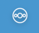
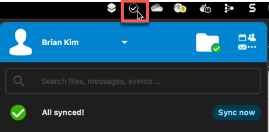
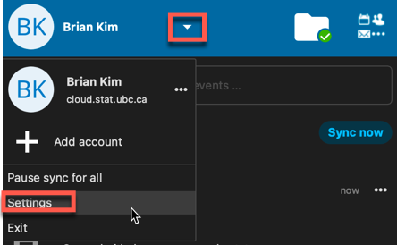
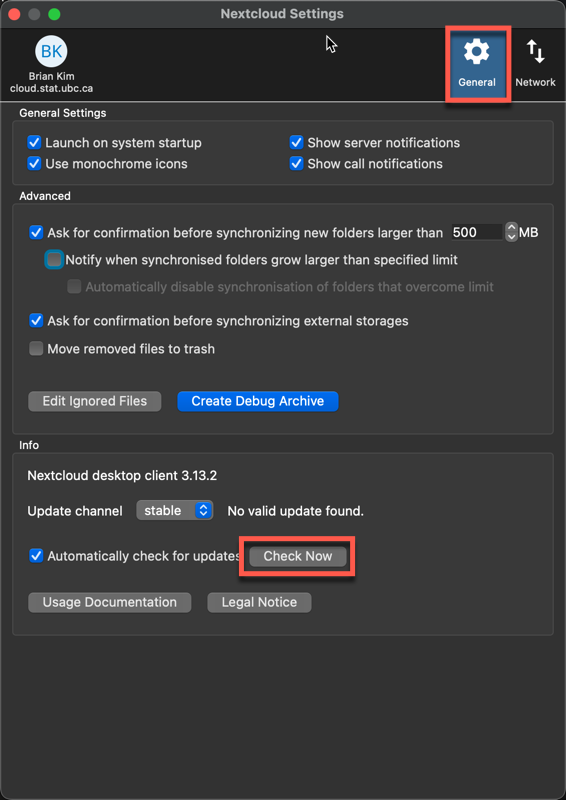
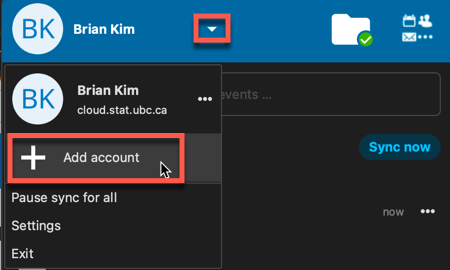

# Nextcloud Migration/Startup Guide

Nextcloud (owncloud.stat.ubc.ca) is a cloud storage service that provides Statistics users with 50GB of file storage. If you aren't already using Nextcloud, you can get started with the [startup guide](#startup-guide).

We will be migrating to a new Nextcloud server as the old Nextcloud server's operating system is reaching end of life status. This document aims to assist Statistics staff, faculty, and students with the transition over to the new server.

During the migration window, access to Nextcloud will be temporarily suspended. Any files already synced locally to your device should still be accessible, however files will not be synced to or downloaded from the server.

If you encounter any issues with the guides below, contact STAT IT at help@stat.ubc.ca for assistance.

# Table of Contents
- [After Migration Steps](#after-migration-steps)
- [Startup Guide](#startup-guide)
- [Add another Account](#add-another-account)

## After Migration Steps

The Statistics IT team will notify all users when the migration has completed through e-mail and Slack. Once you receive the notification, please follow the steps below if you were using Nextcloud before the migration.

1\. Go to your system tray and click the Nextcloud icon to open the Nextcloud window.

**Note**: The icon could also look like this &nbsp; 

2\. Click the **Sync now** button in the window and if the window shows a green checkmark and **All synced!** like the image above, then you can skip to step 6. If not, then continue to step 3.

3\. Click the small downwards pointing arrow beside your name and then click Settings.

4\. Click the **General** menu option and click the **Check Now** button beside the "Automatically check for updates" checkbox.

Follow the prompts on screen to install the latest version of the Nextcloud client. Reboot your device once completed.

5\. Retry steps 1 and 2. If you still do not receive the **All synced!** message, you can try re-installing Nextcloud from [here](https://nextcloud.com/install/) under **Download for Desktop**, try [adding another account](#add-another-account),  or contact Statistics IT support help@stat.ubc.ca.

**Note**: If you find the macOS 12+ installer does not work, try the macOS Virtual Files 12+ installer.

6\. Go to the Nextcloud folder located on your device and check that your files can be opened, renamed, and saved. If so, then your client has been migrated successfully.

## Startup Guide

**This section is only for those who are installing Nextcloud for the first time.**

1\. Install Nextcloud from [here](https://nextcloud.com/install/) under **Download for Desktop**. Reboot your system once the installer is finished.

**Note**: If you find the macOS 12+ installer does not work, try the macOS Virtual Files 12+ installer.

2\. For Mac, open the Nextcloud app under **Finder -> Applications**. For Windows, search for Nextcloud in the Start Menu search bar.

3\. A window will prompt for log in. Use **cloud.stat.ubc.ca** as the "Server address" and it will redirect to a browser to authenticate and grant access to the app. Use your StatNet username and password as credentials. 

4\. Once access is granted, return to the Nextcloud app window. To choose a different location for the Nextcloud folder on your device, click "Choose different folder". Otherwise, click the "Connect" button to complete setup.

5\. Go to your system tray and click the Nextcloud icon to open the Nextcloud window. Confirm that your account is syncing successfully. 

**Note**: The icon could also look like this &nbsp; 

6\. Go to the Nextcloud folder on your device (through Finder on Mac or File Explorer on Windows) and test that you are able to save, delete, and rename files.

## Add another Account

1\. Go to your system tray and click the Nextcloud icon to open the Nextcloud window. Confirm that your account is syncing successfully. 

**Note**: The icon could also look like this &nbsp; 

2\. Click the small downwards pointing arrow beside your name and then click **Add account**.

3\. A window will prompt for log in. Use **cloud.stat.ubc.ca** as the "Server address" and it will redirect to a browser to authenticate and grant access to the app. Use your StatNet username and password as credentials. 

4\. Once access is granted, return to the Nextcloud app window. To choose a different location for the Nextcloud folder on your device, click "Choose different folder". Otherwise, click the "Connect" button to complete setup.

5\. Go to your system tray and click the Nextcloud icon to open the Nextcloud window. Confirm that your account is syncing successfully. 

6\. Go to the Nextcloud folder for the new account on your device (through Finder on Mac or File Explorer on Windows) and test that you are able to save, delete, and rename files.